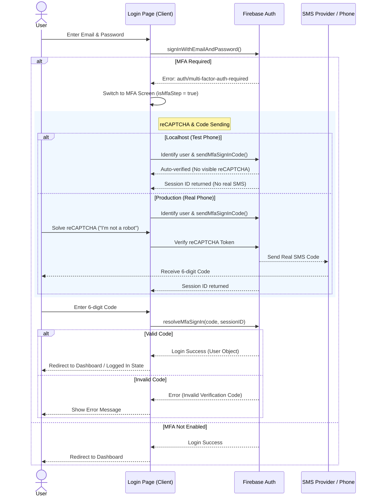

# Login with MFA & reCAPTCHA User Flow

This document describes the user flow for logging in with Multi-Factor Authentication (MFA) enabled, specifically focusing on the differences between the local development environment (using test credentials) and the production environment.

## Overview

The login process involves an initial authentication with email and password, followed by a secondary verification step using an SMS code. This process is secured by reCAPTCHA to prevent abuse.

---

## 1. Local Development Environment (Test Credentials)

When running on `localhost`:

1.  **Initial Login**: The user enters their email and password and clicks "Login".
2.  **MFA Trigger**: The system detects that MFA is enabled for the account. The UI switches to the "2-Step Verification" screen.
3.  **reCAPTCHA (Invisible)**: Since test phone numbers are whitelist-protected, the reCAPTCHA step is typically bypassed or invisible, automatically verifying the request.
4.  **SMS Code (Simulated)**: No actual SMS is sent. The system accepts the pre-configured test verification code (e.g., `123456`).
5.  **Verification**: The user enters the test code `123456` into the input field and clicks "Login".
6.  **Success**: The system verifies the code and completes the login process.

---

## 2. Production Environment (Live Deployment)

When running on the live site (`ssdcp-react.web.app`):

1.  **Initial Login**: The user enters their email and password and clicks "Login".
2.  **MFA Trigger**: The system detects that MFA is enabled. The UI switches to the "2-Step Verification" screen.
3.  **reCAPTCHA (Visible)**: The "I'm not a robot" reCAPTCHA widget appears. The user must manually check the box (and potentially solve a puzzle) to prove they are human.
4.  **SMS Code (Actual)**: Upon successful reCAPTCHA verification, Firebase sends a real SMS with a 6-digit code to the registered phone number.
5.  **Verification**: The user checks their phone, enters the received 6-digit code into the input field, and clicks "Login".
6.  **Success**: The system verifies the code and completes the login process.

---

## 3. Sequence Diagram

