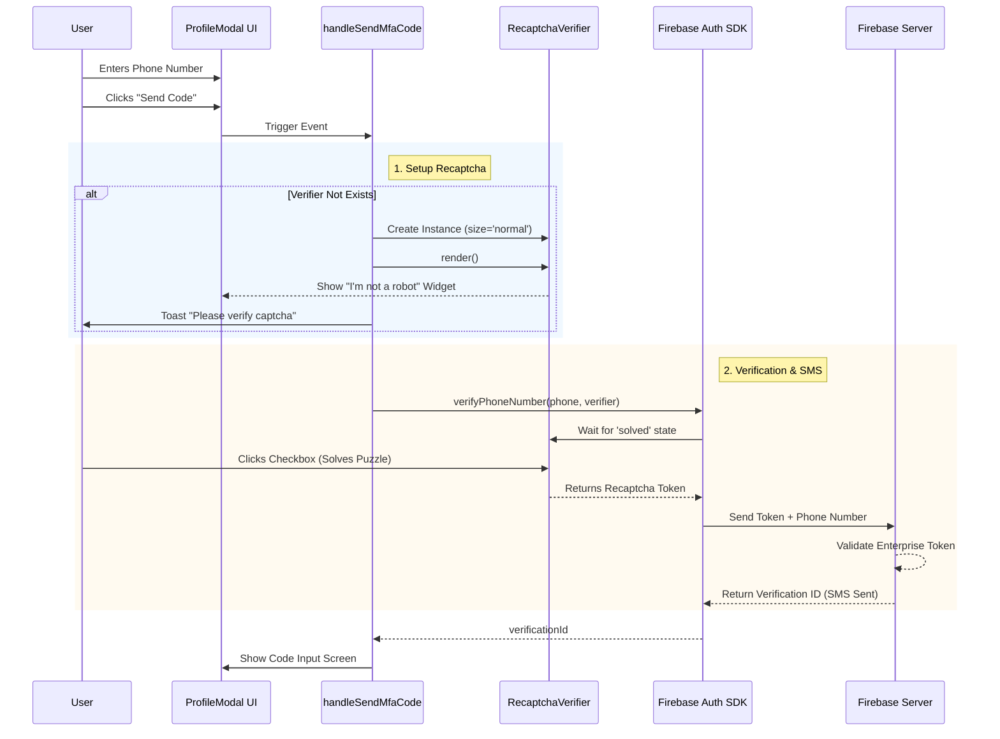
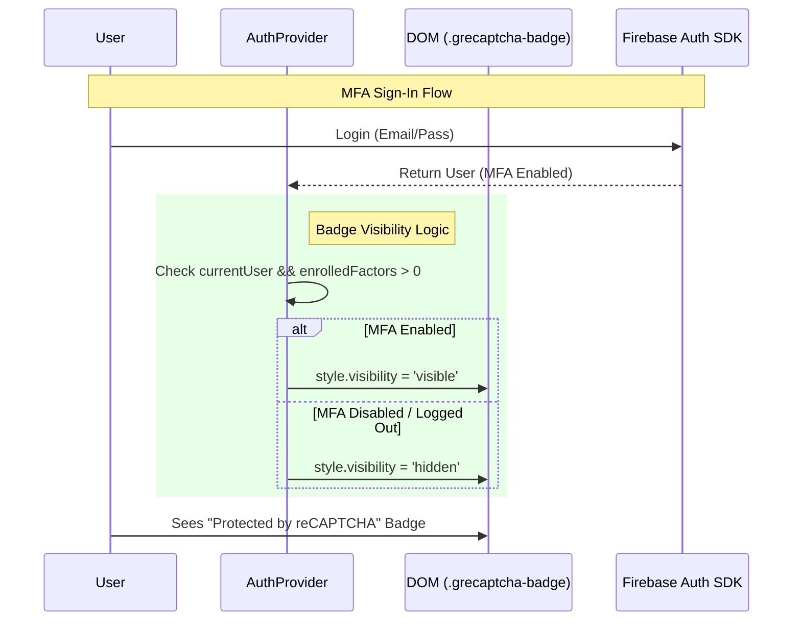

# Firebase Authentication with reCAPTCHA Enterprise Guide

This document serves as a comprehensive guide for developers implementing **reCAPTCHA Enterprise** with Firebase Authentication (MFA). It reflects the current implementation in the **SSDCPD** project.

## 1. Overview

Firebase Authentication uses **reCAPTCHA Enterprise** (SMS Defense) to protect against SMS pumping attacks and abuse.

- **Enrollment (Profile)**: Uses a **Visible (Checkbox)** reCAPTCHA widget. The user must explicitly verify they are human before an SMS is sent.
- **Sign-In (Login)**: Uses an **Invisible** reCAPTCHA (or v3) in the background. A reCAPTCHA badge appears to indicate protection.

---

## 2. Prerequisites & Configuration

Before coding, ensure the environment is set up correctly.

### Firebase Console

1.  **Authentication > Sign-in method > Phone**: Enable Phone authentication.
2.  **Authentication > Settings > SMS Region Policy**: Whitelist target countries (e.g., South Korea +82) to prevent cost leakage.
3.  **Authentication > Settings > reCAPTCHA**:
    - **Phone Auth Enforcement**: `AUDIT` (recommended for dev) or `ENFORCE`.
    - **SMS Risk Score**: Default `1` (Pass all) for testing, lower for strict production security.

### Google Cloud Console (Critical)

1.  **APIs & Services > Credentials**:
    - Locate the **Browser key** (auto-created by Firebase).
    - **Application Restrictions**: Add your domains (`localhost`, `127.0.0.1`, `your-app.web.app`).
    - **API Restrictions**: If restricted, **MUST** include:
      - `Identity Toolkit API`
      - `reCAPTCHA Enterprise API`
      - `Token Service API`

---

## 3. Implementation: MFA Enrollment (ProfileModal)

This flow occurs when a logged-in user enables 2-Factor Authentication (2FA). We use a **visible checkbox** widget.

### Key Logic

- **On-Demand Rendering**: The widget is NOT rendered on page load. It renders only when the user clicks **"Send Code"**.
- **Verification Flow**:
  1.  User enters phone number and clicks "Send Code".
  2.  Code checks if `RecaptchaVerifier` exists. If not, it creates and renders it.
  3.  A prompt asks the user to check the "I'm not a robot" box.
  4.  Firebase SDK automatically waits for the user to solve the challenge.
  5.  Upon solution, the SMS is sent automatically.

### Code Snippet (`ProfileModal.tsx`)

```typescript
const handleSendMfaCode = async () => {
  // 1. Initialize & Render Verifier if missing
  if (!verifierRef.current) {
    const { getRecaptchaVerifier } = await import(
      "../../services/firebaseService"
    );
    const verifier = getRecaptchaVerifier("recaptcha-container"); // size: 'normal'
    verifierRef.current = verifier;
    await verifier.render(); // Shows the widget

    setToast({ message: "Please check the box...", type: "info" });
  }

  // 2. Pass Verifier to Firebase SDK
  // SDK handles the "Wait for user check" logic internally
  const verificationId = await sendMfaEnrollmentCode(
    mfaPhoneNumber,
    verifierRef.current
  );

  // 3. SMS Sent
  setMfaVerificationId(verificationId);
};
```

### Sequence Diagram: MFA Enrollment



---

## 4. Implementation: MFA Sign-In & Badge (AuthProvider)

When a user logs in (or is logged in with MFA enabled), **Invisible reCAPTCHA** protects the session.

### Badge Visibility Control

The reCAPTCHA badge (`protected by reCAPTCHA`) is injected specifically by the Enterprise SDK. We toggle its visibility based on the user's Auth state.

- **Logged In + MFA Enabled**: Badge **Visible**.
- **Logged Out / MFA Disabled**: Badge **Hidden**.

### Code Snippet (`AuthProvider.tsx`)

```typescript
useEffect(() => {
  const updateBadgeVisibility = () => {
    const badge = document.querySelector(".grecaptcha-badge") as HTMLElement;
    if (badge) {
      // Show only if User is logged in AND has MFA enrolled
      const isMfaEnabled =
        currentUser && multiFactor(currentUser).enrolledFactors.length > 0;
      badge.style.visibility = isMfaEnabled ? "visible" : "hidden";
    }
  };
  // Use MutationObserver to handle async script loading
  // ...
}, [currentUser]);
```

### Sequence Diagram: Login & Badge



---

## 5. Troubleshooting Common Issues

### `auth/invalid-app-credential`

- **Cause**: The request domain is not authorized or API Key restrictions block the request.
- **Fix**:
  1.  Check **Authorized Domains** in Firebase Console (add `localhost`).
  2.  Check **API Key Restrictions** in Google Cloud Console. Ensure `reCAPTCHA Enterprise API` and `Identity Toolkit API` are allowed.
  3.  If testing on `localhost`, consider using **Test Phone Numbers** (+82 10-1234-5678) to bypass strict Enterprise checks.

### `auth/invalid-recaptcha-token`

- **Cause**: The token generation failed, was double-used, or timed out.
- **Fix**:
  1.  Ensure you create a **single** instance of `RecaptchaVerifier` (use `useRef`).
  2.  Do NOT call `sendMfaEnrollmentCode` multiple times for one solve.
  3.  If the user cancels, **Clear** the verifier: `verifierRef.current.clear()`.

### `auth/requires-recent-login`

- **Cause**: Security sensitive action (enabling MFA) requires fresh authentication.
- **Fix**: Re-authenticate the user (Logout & Login) before accessing the Profile/MFA settings.
