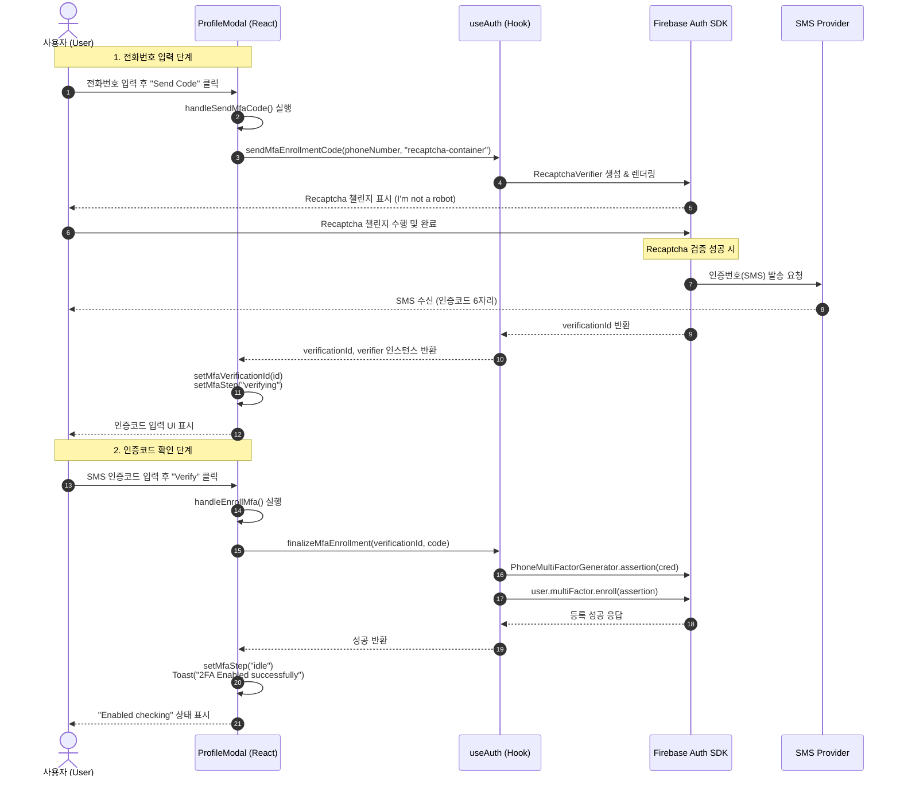

# MFA Enrollment Flow with Recaptcha

이 다이어그램은 `ProfileModal.tsx`에서 구현된 전화번호 기반의 2단계 인증(MFA) 등록 및 Recaptcha 검증 과정을 보여줍니다.

## 주요 단계 설명

1.  **초기화 및 요청**: 사용자가 전화번호를 입력하고 요청하면 `recpatcha-container` ID를 가진 DOM 요소에 Firebase의 보이지 않는(invisible) 혹은 보이는 Recaptcha 위젯이 주입됩니다.
2.  **Recaptcha 검증**: Google은 이 요청이 봇이 아님을 확인하기 위해 Recaptcha를 수행합니다. 이 과정이 통과되어야만 SMS가 발송됩니다. (비용 및 스팸 방지)
3.  **인증 및 등록**: 사용자가 받은 SMS 코드를 입력하면, 앞서 받은 `verificationId`와 결합하여 최종적으로 사용자의 계정에 MFA 요소(Phone Info)를 등록합니다.
